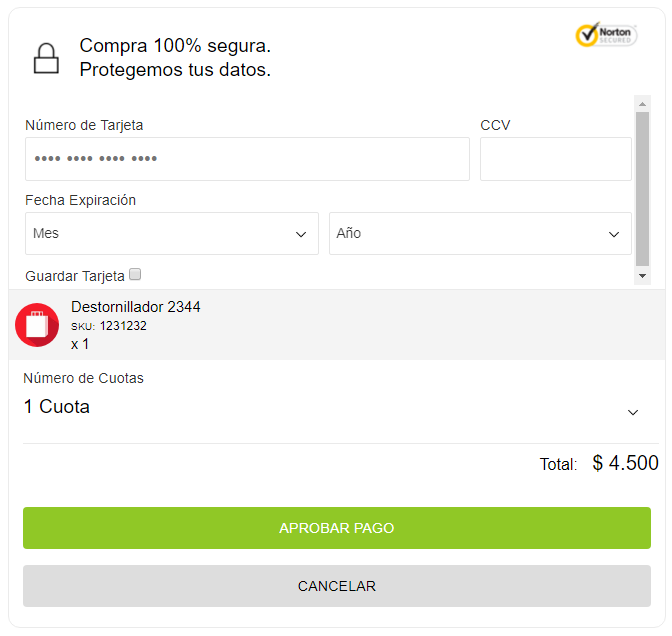

## Crear Intención de pago

Para contiunar con el proceso de pago, debes ingresar en el header de la petición el [access_token](obtener-token-acceso.md) generado en el paso anterior y hacer el llamado de la siguiente forma:

```
curl -X POST 'https://api.qa.peinau.fif.tech/checkout/payments' \
 -H "Content-Type: application/json" \
 -H "Authorization: Bearer REEMPLAZAR AQUI EL ACCESS TOKEN" \
 -d '{ 
{ 
   "intent": "sale", 
   "payer": { 
     "payer_info": { 
       "email": "jlprueba1@quickpay.com", 
       "full_name": "Andres Roa",
       "country": "CL",
       "document_number": "123123123",
       "document_type": "RUT"
     }, 
     "payment_method": "QUICKPAY_TOKEN"
   }, 
   "transaction": { 
     "reference_id": "OD0000233", 
     "gateway_order": "QP00009",
     "description": "Transaction detailed description", 
     "soft_descriptor": "Short Description", 
     "amount": { 
       "currency": "CLP", 
       "total": 4500, 
       "details": { 
         "subtotal": 810, 
         "tax": 190, 
         "shipping": 0, 
         "shipping_discount": 0 
       } 
     }, 
     "item_list": { 
       "shipping_address": { 
         "line1": "Miraflores 222", 
         "city": "Santiago", 
         "country_code": "CL", 
         "phone": "+56 9 1234 5674", 
         "type": "HOME_OR_WORK", 
         "recipient_name": "Andres Roa" 
       }, 
       "shipping_method": "DIGITAL", 
       "items": [ 
         { 
           "sku": "1231232", 
           "name": "Destornillador 2344", 
           "description": "Destornillador SCL - ONT", 
           "quantity": 1, 
           "price": 4500, 
           "tax": 0 
         } 
       ] 
     } 
   }, 
   "redirect_urls": { 
     "return_url": "https://peinau.azureedge.net/redirections/payment_success.html", 
     "cancel_url": "https://chao.com" 
   },
   "additional_attributes": {
  }
 }' | json_pp
```

Como respuesta obtendrás la siguiente información:

```
{
    "intent": "sale",
    "application": "ff462a80-f2a8-1390-06cf-57d5f9728b8d",
    "redirect_urls": {
        "return_url": "https://peinau.azureedge.net/redirections/payment_success.html",
        "cancel_url": "https://chao.com"
    },
    "transaction": {
        "reference_id": "OD0000233",
        "gateway_order": "QP00009",
        "description": "Transaction detailed description",
        "soft_descriptor": "Short Description",
        "item_list": {
            "shipping_method": "DIGITAL",
            "items": [
                {
                    "sku": "1231232",
                    "name": "Destornillador 2344",
                    "description": "Destornillador SCL - ONT",
                    "quantity": 1,
                    "price": 4500,
                    "tax": 0
                }
            ],
            "shipping_address": {
                "line1": "Miraflores 222",
                "city": "Santiago",
                "country_code": "CL",
                "phone": "+56 9 1234 5674",
                "type": "HOME_OR_WORK",
                "recipient_name": "Andres Roa"
            }
        },
        "amount": {
            "currency": "CLP",
            "total": 4500,
            "details": {
                "subtotal": 810,
                "tax": 190,
                "shipping": 0,
                "shipping_discount": 0
            }
        }
    },
    "payer": {
        "payer_info": {
            "document_type": "RUT",
            "document_number": "123123123",
            "country": "CL",
            "full_name": "Andres Roa",
            "email": "jlprueba1@quickpay.com"
        },
        "payment_method": "QUICKPAY_TOKEN"
    },
    "links": [
        {
            "href": "https://api.qa.peinau.fif.tech/checkout/payments/19a516df-b027-443e-be15-e44a41dbd94f",
            "rel": "self",
            "security": [
                "ApiKey"
            ],
            "method": "GET"
        },
        {
            "href": "https://api.qa.peinau.fif.tech/checkout/payments/gateways/quickpay/token/19a516df-b027-443e-be15-e44a41dbd94f/pay",
            "rel": "approval_url",
            "method": "REDIRECT"
        },
        {
            "href": "https://api.qa.peinau.fif.tech/checkout/payments/19a516df-b027-443e-be15-e44a41dbd94f/edit",
            "rel": "update_url",
            "method": "PUT"
        },
        {
            "href": "https://api.qa.peinau.fif.tech/checkout/payments/gateways/quickpay/token/19a516df-b027-443e-be15-e44a41dbd94f/silent",
            "rel": "silent_charge",
            "security": [
                "Jwt"
            ],
            "method": "POST"
        },
        {
            "href": "https://api.qa.peinau.fif.tech/checkout/payments/gateways/quickpay/token/19a516df-b027-443e-be15-e44a41dbd94f/refund",
            "rel": "refund_method",
            "security": [
                "Jwt"
            ],
            "method": "POST"
        },
        {
            "href": "https://api.qa.peinau.fif.tech/checkout/payments/QP00009",
            "rel": "self_by_gateway_order",
            "security": [
                "ApiKey"
            ],
            "method": "GET"
        }
    ],
    "id": "19a516df-b027-443e-be15-e44a41dbd94f",
    "expiration_date": "2018-04-13T16:14:05.229Z",
    "create_time": "2018-04-10T16:14:05.309Z",
    "update_time": "2018-04-10T16:14:05.309Z",
    "state": "created",
    "invoice_number": "INPA-0000012364"
}
```

Obtendrás los Links:

- **self**: desde esta URL puedes consultar la información del pago.
- **approval_url**: debes desplegar esta URL al cliente para que pueda continuar con el pago.
- **refund_method**: te permite anular la transacción.
- **self_by_gateway_order**: desde esta URL también puedes consultar la información del pago utilizando el gateway_order.

## Mostrar Formulario Checkout

Con la **approval_url** obtenida en el paso anterior debes desplegar el formulario de Checkout (pago).



El cliente debe ingresar los datos de la tarjeta, seleccionar las cuotas y aprobar el pago para que nuestro sistema pueda ejecutar el cargo a la tarjeta de crédito. 

> **Importante** El sistema redireccionará la url de éxito o error enviadas por el comercio en la creación de la intención de pago en los atributos **"redirect_urls.return_url"** y **"redirect_urls.cancel_url"**, según sea la respuesta recibida por el autorizador.

Para finalizar, debes consultar el estado de la transacción

## Consultar Estado de la Transacción

para consultar el estado (state) de la transacción necesitas enviar el **access_token** (en el header de la petición) obtenido en la **Autenticación**, la **url self** obtenida como respuesta de la intención de pago y ejecutar la consulta de la siguiente forma:

```
curl -X GET \
  https://api.qa.peinau.fif.tech/checkout/payments/19a516df-b027-443e-be15-e44a41dbd94f \
  -H 'cache-control: no-cache' \
  -H 'Authorization: Bearer REEMPLAZAR AQUI EL ACCESS TOKEN'
```
Obtendrás una respuesta silimar a:

  ```
{
    "intent": "sale",
    "application": "ff462a80-f2a8-1390-06cf-57d5f9728b8d",
    "redirect_urls": {
        "return_url": "https://peinau.azureedge.net/redirections/payment_success.html",
        "cancel_url": "https://chao.com"
    },
    "transaction": {
        "reference_id": "OD0000233",
        "gateway_order": "QP00009",
        "description": "Transaction detailed description",
        "soft_descriptor": "Short Description",
        "item_list": {
            "shipping_method": "DIGITAL",
            "items": [
                {
                    "sku": "1231232",
                    "name": "Destornillador 2344",
                    "description": "Destornillador SCL - ONT",
                    "quantity": 1,
                    "price": 4500,
                    "tax": 0,
                    "_id": "5acce2cd8d0f81000f9c5f5b"
                }
            ],
            "shipping_address": {
                "line1": "Miraflores 222",
                "city": "Santiago",
                "country_code": "CL",
                "phone": "+56 9 1234 5674",
                "type": "HOME_OR_WORK",
                "recipient_name": "Andres Roa"
            }
        },
        "amount": {
            "currency": "CLP",
            "total": 4500,
            "details": {
                "subtotal": 810,
                "tax": 190,
                "shipping": 0,
                "shipping_discount": 0
            }
        }
    },
    "payer": {
        "payer_info": {
            "document_type": "RUT",
            "document_number": "123123123",
            "country": "CL",
            "full_name": "Andres Roa",
            "email": "jlprueba1@quickpay.com"
        },
        "payment_method": "QUICKPAY_TOKEN"
    },
    "links": [
        {
            "href": "https://api.qa.peinau.fif.tech/checkout/payments/19a516df-b027-443e-be15-e44a41dbd94f",
            "rel": "self",
            "security": [
                "ApiKey"
            ],
            "method": "GET"
        },
        {
            "href": "https://api.qa.peinau.fif.tech/checkout/payments/gateways/quickpay/token/19a516df-b027-443e-be15-e44a41dbd94f/pay",
            "rel": "approval_url",
            "method": "REDIRECT"
        },
        {
            "href": "https://api.qa.peinau.fif.tech/checkout/payments/19a516df-b027-443e-be15-e44a41dbd94f/edit",
            "rel": "update_url",
            "method": "PUT"
        },
        {
            "href": "https://api.qa.peinau.fif.tech/checkout/payments/gateways/quickpay/token/19a516df-b027-443e-be15-e44a41dbd94f/silent",
            "rel": "silent_charge",
            "security": [
                "Jwt"
            ],
            "method": "POST"
        },
        {
            "href": "https://api.qa.peinau.fif.tech/checkout/payments/gateways/quickpay/token/19a516df-b027-443e-be15-e44a41dbd94f/refund",
            "rel": "refund_method",
            "security": [
                "Jwt"
            ],
            "method": "POST"
        }
    ],
    "id": "19a516df-b027-443e-be15-e44a41dbd94f",
    "expiration_date": "2018-04-13T16:14:05.229Z",
    "create_time": "2018-04-10T16:14:05.309Z",
    "update_time": "2018-04-10T16:19:56.253Z",
    "state": "paid",
    "invoice_number": "INPA-0000012364",
    "gateway": {
        "capture_token": "9615786e-52c9-7733-39db-5bf5d600e5d6",
        "payment_flow": "express_checkout",
        "installments_number": "1",
        "merchantReferenceCode": "INPA-0000012364",
        "requestID": "5233771897036565504009",
        "decision": "ACCEPT",
        "reasonCode": "100",
        "requestToken": "Ahj//wSTG7ktAqSOzeAJig9GgwYMGDlLi7x5j7AUuLvHmPsmBsZR+khk0ky3SA32gQMCcmN3JaBUkdm8ASAA4yx9",
        "purchaseTotals": {
            "currency": "CLP"
        },
        "ccAuthReply": {
            "reasonCode": "100",
            "amount": "4500",
            "authorizationCode": "155328",
            "avsCode": "1",
            "cvCode": "3",
            "authorizedDateTime": "2018-04-10T16:19:56Z",
            "processorResponse": "0",
            "reconciliationID": "QP00009",
            "ownerMerchantID": "falabella_cl",
            "processorTransactionID": "eeda1fd175e8e86b582e8934290f4e5dbfb50ba05d7a968b8afb93277a97aa55"
        },
        "ccCaptureReply": {
            "reasonCode": "100",
            "requestDateTime": "2018-04-10T16:19:56Z",
            "amount": "4500",
            "reconciliationID": "QP00009"
        },
        "additionalProcessorResponse": "2d13b5c5-1159-406b-8eaa-17c00d50b24d",
        "capture_data": {
            "panFirst6": "411111",
            "panLast4": "1111"
        },
        "resume": {
            "_id": "5acce42c8d0f81000f9c5f5e",
            "card_number": {
                "pan_last4": "1111",
                "pan_first6": "411111"
            },
            "authorizations": {
                "code": "155328"
            },
            "transaction": {
                "gateway_id": "5233771897036565504009",
                "type": "CREDIT",
                "date": "2018-04-10T16:19:56.250Z",
                "currency": "CLP",
                "buy_order": "INPA-0000012364",
                "amount": 4500,
                "installments_number": 1
            },
            "response": {
                "code": 100
            }
        }
    }
}
```
Posibles estados de la transacción hasta este punto:
  
| State    | Definición                               |
| -------- | ---------------------------------------- |
| paid  | El cargo fue realizado exitosamente en la cuenta del cliente |
| rejected | El cargo no fue realizado |

Para realizar [pagos recurrentes](pagos-recurrentes.md).  
Si deseas hacer la devolución al cliente, debes llamar a [API de Anulación (**refund_method**)](anulacion.md).
